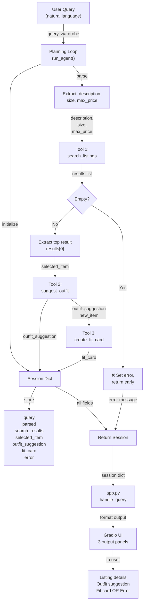

# FitFindr — planning.md

> Complete this document before writing any implementation code.
> Your spec and agent diagram are what you'll use to direct AI tools (Claude, Copilot, etc.) to generate your implementation — the more specific they are, the more useful the generated code will be.
> Your planning.md will be reviewed as part of your submission.
> Update it before starting any stretch features.

---

## Tools

List every tool your agent will use. For each tool, fill in all four fields.
You must have at least 3 tools. The three required tools are listed — add any additional tools below them.

### Tool 1: search_listings

**What it does:**
Searches the mock listings dataset for items matching the provided description, optional size, and optional price ceiling. Returns matching listings sorted by relevance (highest-scoring matches first).

**Input parameters:**
- `description` (str): Keywords describing what the user is looking for (e.g., "vintage graphic tee", "baggy jeans"). Used for semantic matching against title, description, style_tags, and category.
- `size` (str or None): Size string to filter by, or None to skip size filtering. Matching is case-insensitive substring match (e.g., "M" matches "S/M", "L", "M/L").
- `max_price` (float or None): Maximum price (inclusive), or None to skip price filtering. Filters to items where price <= max_price.

**What it returns:**
A list of matching listing dicts, sorted by relevance score (highest score first). Returns an empty list `[]` if nothing matches, does NOT raise an exception. Each listing dict contains: id (str), title (str), description (str), category (str), style_tags (list[str]), size (str), condition (str), price (float), colors (list[str]), brand (str or None), platform (str).

**What happens if it fails or returns nothing:**
If results is empty, agent sets session["error"] to an informative message like "No listings matched 'designer ballgown' at that price. Try different keywords, a higher budget, or skip the size filter." The agent then returns the session early without calling suggest_outfit or create_fit_card.

---

### Tool 2: suggest_outfit

**What it does:**
Given a thrifted item and the user's existing wardrobe, uses an LLM (Groq llama-3.3-70b-versatile) to suggest 1–2 complete outfit combinations. Provides practical styling tips: what pieces to pair with, how to layer, accessories, and styling techniques (e.g., rolling sleeves, tucking, belting).

**Input parameters:**
- `new_item` (dict): The listing dict from search_listings, containing id, title, description, category, style_tags, size, condition, price, colors, brand, platform.
- `wardrobe` (dict): The user's wardrobe dict with structure {"items": [list of wardrobe items]}. Each wardrobe item dict contains: id (str), name (str), category (str), colors (list[str]), style_tags (list[str]), notes (str or None).

**What it returns:**
A string containing 1–2 outfit suggestions (2–4 sentences). Example: "Pair this faded band tee with your baggy dark wash jeans and chunky white sneakers for that authentic 90s grunge aesthetic. Layer your vintage black denim jacket over it. Roll the sleeves once to show the distressing."

**What happens if it fails or returns nothing:**
If wardrobe["items"] is empty (new user, no wardrobe entered), the LLM still returns a useful string with general styling advice based on the item's category and style_tags alone: "This faded band tee has a vintage grunge aesthetic. Try pairing with high-waisted baggy denim and chunky boots for an authentic 90s look." If the API call itself fails, I still return a local fallback styling sentence instead of crashing or returning empty.

---

### Tool 3: create_fit_card

**What it does:**
Given an outfit suggestion string and the new item details, uses an LLM to generate a short, shareable Instagram-style caption. The caption should sound authentic and personal (not like a product description), incorporate relevant details from the listing (price, platform, style tags), and feel natural with emojis.

**Input parameters:**
- `outfit` (str): The outfit suggestion string returned by suggest_outfit (the full styling recommendation).
- `new_item` (dict): The listing dict from search_listings (used to extract title, price, platform, condition for natural reference in the caption).

**What it returns:**
A string caption, typically 1–3 sentences with 1–3 relevant emojis, that reads like an authentic social media post. Example: "grabbed this faded band tee off depop for $19 and the distressed graphic hits different 🖤 pairs perfectly with my baggy jeans and chunky sneakers. vintage grunge is SO the move".

**What happens if it fails or returns nothing:**
If outfit string is empty or None, return a descriptive error message string: "Unable to generate fit card, outfit suggestion was incomplete. Try searching for a different item." If the API call fails, return a short fallback caption instead of crashing.

---

### Additional Tools (if any)

<!-- Copy the block above for any tools beyond the required three -->

---

## Planning Loop

**How does your agent decide which tool to call next?**

The planning loop is a sequential decision tree that responds to what each tool returns:

**Step 1:** Initialize session with _new_session(query, wardrobe).

**Step 2:** Parse the user's natural language query to extract description, size, and max_price. Use simple string matching with regex: look for patterns like "under $X" → max_price, "size M" or "M" → size, rest → description. Store result in session["parsed"].

**Step 3:** Call search_listings(description, size, max_price). Store results in session["search_results"].

**Step 4 — CRITICAL BRANCH:** 
- **If results is empty** (len(results) == 0): Set session["error"] to a helpful message like "No listings matched your search. Try different keywords, a higher budget, or remove size filters." Then **return the session immediately**, do not proceed to suggest_outfit. This is the error path.
- **If results is not empty**: Extract the top result (results[0]) and store it in session["selected_item"].

**Step 5:** Call suggest_outfit(session["selected_item"], session["wardrobe"]). Store output in session["outfit_suggestion"].

**Step 6:** Call create_fit_card(session["outfit_suggestion"], session["selected_item"]). Store output in session["fit_card"].

**Step 7:** Return the completed session dict.

The loop terminates early only if search_listings returns empty. Otherwise, all three tools are called in sequence, with each tool consuming the output of the previous one.

---

## State Management

**How does information from one tool get passed to the next?**

All state is stored in a single session dict, initialized at the start of run_agent() and returned at the end. This ensures data from one tool is available to the next without re-prompting the user.

**Session dict structure:**
```python
{
    "query": str,                      # original user query
    "parsed": dict,                    # {"description": str, "size": str or None, "max_price": float or None}
    "search_results": list[dict],      # full list of matching listing dicts from search_listings
    "selected_item": dict or None,     # the top result (results[0]), passed to suggest_outfit and create_fit_card
    "wardrobe": dict,                  # the user's wardrobe dict, passed at start and used by suggest_outfit
    "outfit_suggestion": str or None,  # string returned by suggest_outfit, passed to create_fit_card
    "fit_card": str or None,           # final caption string from create_fit_card
    "error": str or None,              # set if interaction ends early; None on success
}
```

**Data flow:**
1. search_listings returns a list → stored in session["search_results"]
2. results[0] extracted → stored in session["selected_item"]
3. selected_item passed to suggest_outfit() → outfit_suggestion returned → stored in session["outfit_suggestion"]
4. outfit_suggestion passed to create_fit_card() → fit_card returned → stored in session["fit_card"]

**Example:**
After search_listings finds a band tee, session["selected_item"] is the band tee dict. When suggest_outfit is called with that dict, it returns styling recommendations. Those recommendations are stored in session["outfit_suggestion"]. When create_fit_card is called with that string, it generates the caption. No data is lost or re-entered between steps.

---

## Error Handling

For each tool, describe the specific failure mode you're handling and what the agent does in response.

| Tool | Failure mode | Agent response |
|------|-------------|----------------|
| search_listings | No results match the query | Return empty list []. Planning loop checks if results is empty. If yes, set session["error"] = "No listings matched 'designer ballgown' at that price. Try different keywords, a higher budget, or skip size filters." Return session early without calling suggest_outfit or create_fit_card. User sees the error message in the output panel. |
| suggest_outfit | Wardrobe is empty (new user, no items) | LLM provides general styling advice based on the item alone, without referencing specific wardrobe pieces. Returns string like: "This faded band tee has vintage grunge vibes. Try pairing with high-waisted jeans and chunky boots for authenticity." Agent does not crash or skip this step. |
| create_fit_card | Outfit string is empty or None | Return error message string: "Unable to generate fit card, outfit suggestion was incomplete. Try searching for a different item." Agent does not crash. User sees the error in the fit card panel. |


---

## Architecture



---

## AI Tool Plan

**Milestone 3 — Individual tool implementations:**

**Tool 1 (search_listings):**
- AI tool: Claude
- Input: Tool 1 spec block (what it does, input parameters, what it returns, failure mode) + note to use load_listings() from utils/data_loader.py
- Expected output: Complete function implementation that filters listings by price and size, scores by keyword overlap with description, returns sorted list
- Verification: Before using, check (1) does it filter price correctly? (2) does it handle size=None? (3) does it return empty list (not exception) on no matches? Then test with 3 queries: "vintage graphic tee" (should find lst_033), "designer ballgown under $5" (should return []), "jacket" with max_price=10 (should only include items under $10)

**Tool 2 (suggest_outfit):**
- AI tool: Claude
- Input: Tool 2 spec block + reminder to call Groq LLM with llama-3.3-70b-versatile + .env GROQ_API_KEY
- Expected output: Function that constructs an LLM prompt with new_item details and wardrobe items, calls Groq API, returns suggestion string
- Verification: Before using, check (1) does it handle empty wardrobe (items=[])? (2) does the LLM prompt include both item and wardrobe context? (3) does it return a non-empty string? Test with: full wardrobe + item (should suggest specific pairing), empty wardrobe + item (should give general advice)

**Tool 3 (create_fit_card):**
- AI tool: Claude
- Input: Tool 3 spec block + reminder about temperature for variability
- Expected output: Function that constructs an LLM prompt with outfit and new_item (title, price, platform), calls Groq API with temperature=0.8, returns caption string
- Verification: Before using, check (1) does it handle empty outfit string? (2) does output vary across multiple runs? (3) does caption include price/platform naturally? Test with: good outfit (should produce varied captions), empty outfit (should return error message)

**Milestone 4 — Planning loop and state management:**

**Planning Loop (run_agent):**
- AI tool: Claude
- Input: Planning Loop section + State Management section + Architecture diagram
- Expected output: Fully implemented run_agent() function following the sequential decision tree: parse query → search → branch on empty results → if found, call suggest_outfit → call create_fit_card → return session
- Verification: Before using, check (1) does it branch on empty search_results? (2) does it return early on error? (3) does it pass selected_item to suggest_outfit and to create_fit_card? Test with: query with results (should populate all 3 outputs), impossible query like "designer ballgown $5 XXS" (should populate error field only)

**App handler (handle_query):**
- AI tool: Claude
- Input: Function signature + 3-panel output structure from app.py
- Expected output: handle_query() that calls run_agent(), checks session["error"], formats session["selected_item"] into readable listing_text, returns (listing_text, outfit_suggestion, fit_card) tuple
- Verification: Run python app.py, test with real queries, confirm all 3 panels populate and state flows correctly

---

## A Complete Interaction (Step by Step)

Write out what a full user interaction looks like from start to finish — tool call by tool call. Use a specific example query.

**Example user query:** "I'm looking for a vintage graphic tee under $30. I mostly wear baggy jeans and chunky sneakers. What's out there and how would I style it?"

**Overview:** FitFindr's job is to take a natural language search query, find matching secondhand listings, evaluate how they fit with what the user already owns, and create a shareable outfit description. If search_listings returns empty results or suggest_outfit fails, the agent communicates that to the user and stops it doesn't proceed with garbage input.

**Step 1:** Parse and search
- Agent extracts from the query: description="vintage graphic tee", size=None (not mentioned), max_price=30.0
- Calls search_listings("vintage graphic tee", None, 30.0)
- Returns matching listings like [{"id": "lst_033", "title": "Vintage Band Tee — Faded Grey", "description": "Faded grey band-style tee with distressed graphic. Crew neck. Fits boxy. Well-loved but no holes or major damage.", "category": "tops", "style_tags": ["vintage", "grunge", "band tee", "graphic tee", "streetwear"], "size": "L", "condition": "fair", "price": 19.00, "colors": ["grey", "charcoal"], "brand": null, "platform": "depop"}, ...]
- Agent stores top result in session["selected_item"] and proceeds to next tool

**Step 2:** Suggest outfit
- Agent calls suggest_outfit(new_item=<band tee from step 1>, wardrobe=<user's wardrobe>)
- LLM sees user has: baggy dark wash jeans, chunky white sneakers, black combat boots, vintage black denim jacket, grey sweatshirt
- LLM considers the item: faded grey band tee (boxy fit, vintage grunge style)
- Returns: "Pair this faded band tee with your baggy dark wash jeans and chunky white sneakers for that authentic 90s grunge aesthetic. Layer your vintage black denim jacket over it. Roll the sleeves once to show the distressing and add some dimension. Tuck just the front corner slightly into your jeans for a subtle fitted look that balances the boxy tee."
- Agent stores this in session["outfit_suggestion"]

**Step 3:** Create fit card
- Agent calls create_fit_card(outfit=<suggestion from step 2>, new_item=<band tee>)
- LLM generates a shareable Instagram-style caption using the actual listing details (title, price, platform, condition)
- Returns: "grabbed this faded band tee off depop for $19 and the distressed graphic hits different 🖤 pairs perfectly with my baggy jeans and chunky sneakers. vintage grunge is SO the move"
- Agent stores in session["fit_card"]

**Final output to user:**
The user sees three panels:
1. **Listing details:** "Vintage Band Tee — Faded Grey | Depop | $19.00 | Fair condition | Style: vintage, grunge, band tee, graphic tee, streetwear | Size: L | Colors: grey, charcoal"
2. **Outfit suggestion:** "Pair this faded band tee with your baggy dark wash jeans and chunky white sneakers for that authentic 90s grunge aesthetic. Layer your vintage black denim jacket over it..."
3. **Fit card:** "grabbed this faded band tee off depop for $19 and the distressed graphic hits different 🖤 pairs perfectly with my baggy jeans and chunky sneakers. vintage grunge is SO the move"
